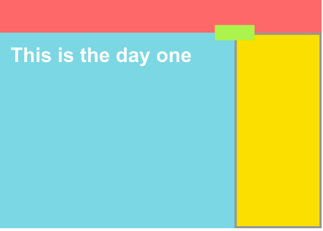

Coding Challenge 01

Based on what you learnt on the videos #3.1 to #3.6, this is the screen you would have to produce.

Requirements:

- The <body> has to have a height of 1500px;
- The top red bar should stay at the top of the page even if I scroll.
- The white title should have a 50px space from the borders of the blue box.
- The yellow box should have a grey border.
- There should be one .css file and one .html file.
- The green box should be in the intersection between the red, blue and yellow.

구현 과제 실행
- 결과물: https://codesandbox.io/s/1rz08jwvql
- 정답: https://codesandbox.io/s/nn641o5v54