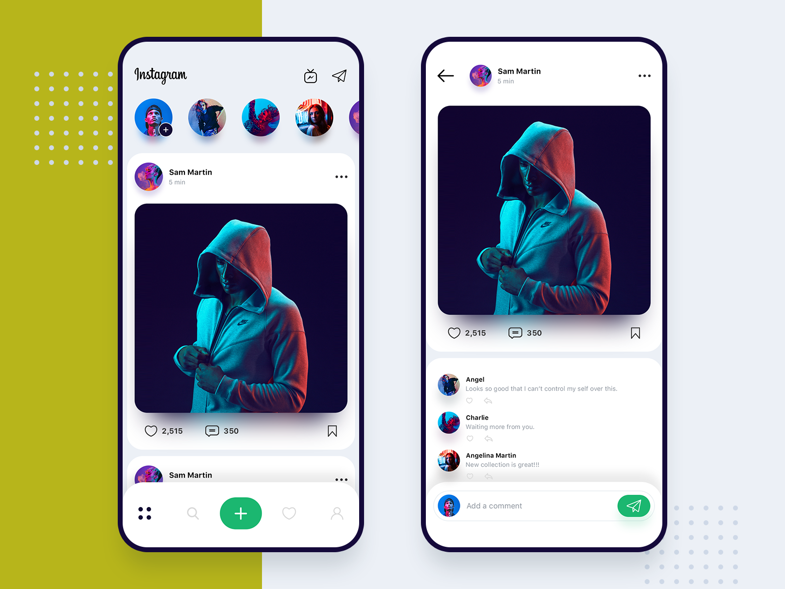

# Coding Challenge 06

Based on what you learnt on the practice videos #1.6 to #1.9.
Make the HTML (only HTML, not CSS) of the following screens:

[Link to image](https://dribbble.com/shots/6349659-Instagram-redesign-concept/attachments)

Requirements:
- Use a combination of classes and IDs
- Try to use semantic tags such as <section> <header> <footer> 
- etc… Use Font Awesome Icons and Images

구현 과제 실행
- 결과물: https://codesandbox.io/s/9ypk390z8r
- 정답: https://codesandbox.io/s/2w4kkl1p8r