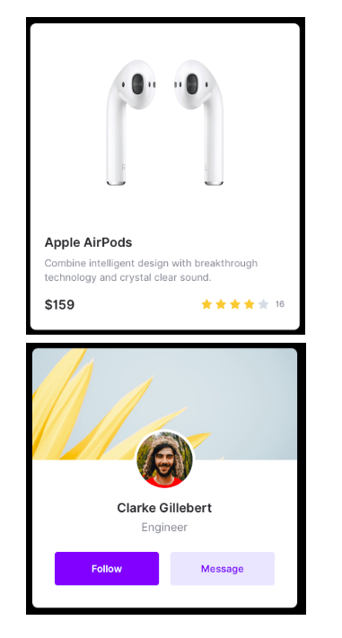

# Coding Challenge 07

Based on what you learnt on the practice videos #2.0 to #2.3.
You need to reproduce the following two components with CSS.

Requirements:

- Use flex box
- Use Google Fonts
- Use Font Awesome

구현 과제 실행

- 결과물: https://codesandbox.io/s/333zp589p
- 정답: https://codesandbox.io/s/znpprpw58l
