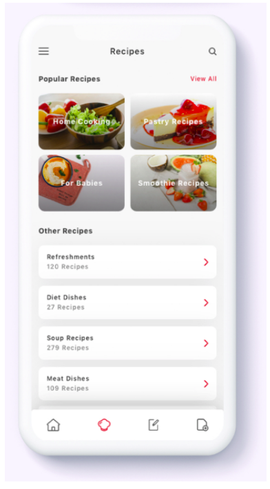

# Coding Challenge 10
Based on what you learnt on the practice videos #2.11 to #2.13.
You need to reproduce the following screen with CSS.

Requirements:
- Use flex box
- Use Google Fonts
- Use Font Awesome

구현 과제 실행

- 결과물: https://codesandbox.io/s/3y54ljxv3m
- 정답:
