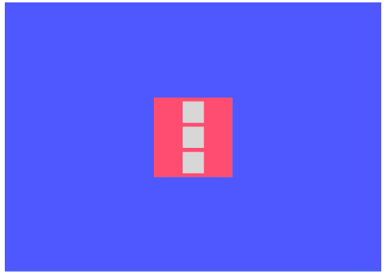

Coding Challenge 02

Based on what you learnt on the videos #3.7 to #3.10, this is the screen you would have to produce.

Requirements:

Everything has to be done with flexbox.
No margins or paddings allowed.
The second grey box has to become red when the mouse is on top of it.
The grey boxes can only have one class name.

구현 과제 실행
- 결과물: https://codesandbox.io/s/q9q78lmp44
- 정답: https://codesandbox.io/s/50rvxv193p