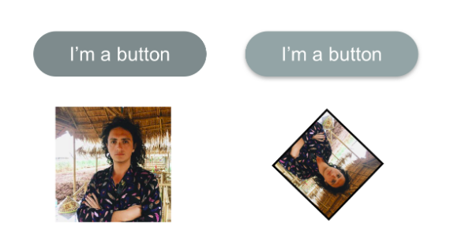

Coding Challenge 03
Based on what you learnt on the videos #4.1 to #4.3.
These are the elements you will have to make:

The left column is the element on the normal state and the right is the element when the mouse is on top of it.

Requirements:
There has to be an animation between the two states.
The button should have round borders and shadows

Clues:
You will need to use new properties like ‘box-shadow’ and ‘border-radius’

구현 과제 실행
- 결과물: https://codesandbox.io/s/myo48w44yx
- 정답:  