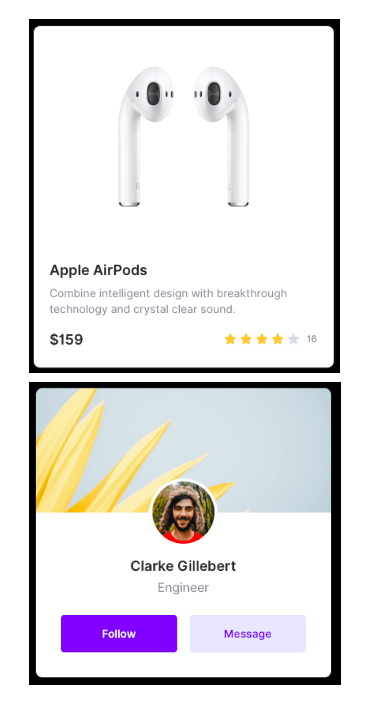

# Coding Challenge 08

Based on what you learnt on the practice videos #2.4 to #2.7.
You need to reproduce the screen with CSS

Requirements:

- Use flex box
- Use Google Fonts
- Use Font Awesome

You don’t need to reproduce the phone, you can do it by CSS but is not necessary. Focus on making the screen.

구현 과제 실행

- 결과물: https://codesandbox.io/s/1qyxxml724
- 정답: https://codesandbox.io/s/7wkzmj8n9q
