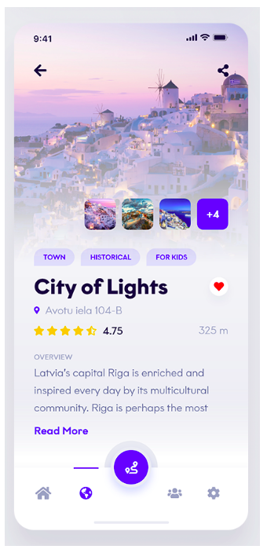

# Coding Challenge 09

Based on what you learnt on the practice videos #2.8 to #2.10.
You need to reproduce the following screen with CSS

Requirements:

- Use flex box
- Use Google Fonts
- Use Font Awesome

구현 과제 실행

- 결과물: https://codesandbox.io/s/o5z1wpwxn9
- 정답:
